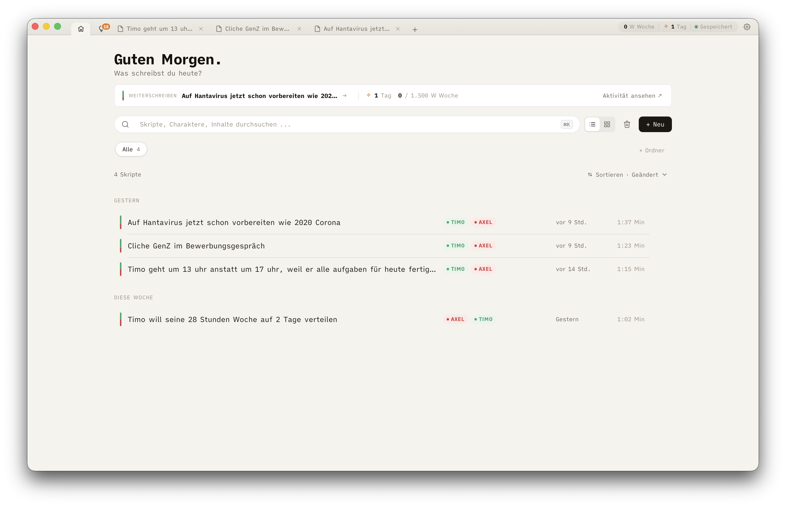
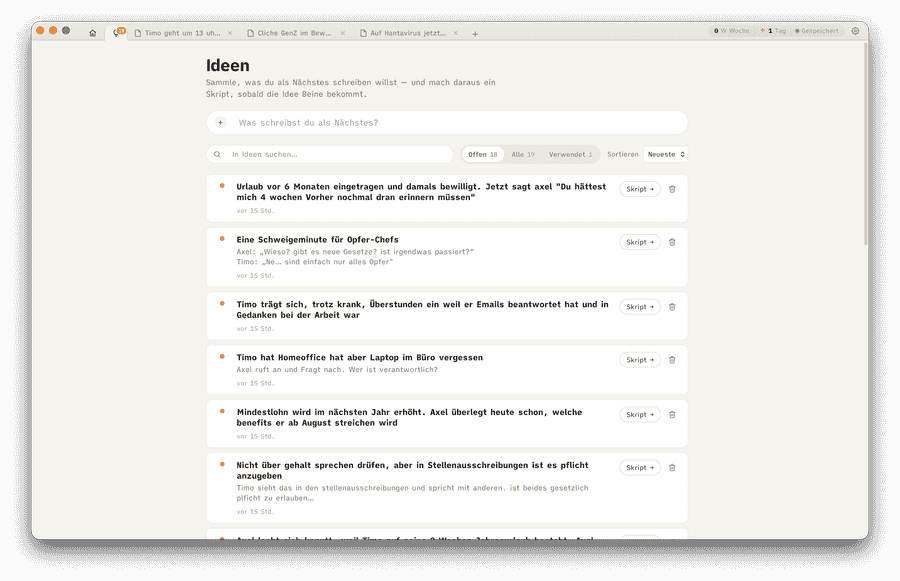
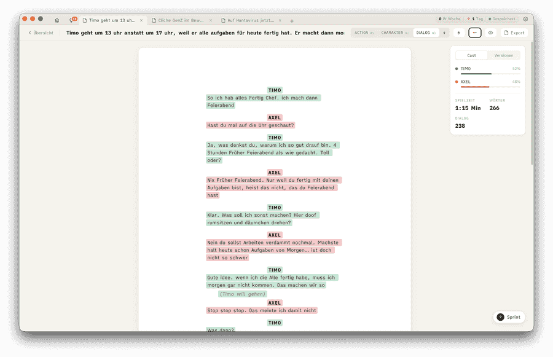

<p align="center">
  
</p>

<h1 align="center">ScriptZ</h1>

<p align="center">
  <strong>Write, don't format.</strong><br/>
  <em>The script editor for TikTok, Reels and YouTube Shorts creators.</em>
</p>

<p align="center">
  <a href="https://github.com/AgentZ-Media/ScriptZ/releases/latest"></a>
  
  
</p>

<p align="center">
  
  
  
  
</p>

<p align="center">
  <a href="https://write-scriptz.com">write-scriptz.com</a> ·
  <a href="https://app.write-scriptz.com">try in browser</a> ·
  <a href="https://github.com/AgentZ-Media/ScriptZ/releases/latest">download</a>
</p>

---

## From empty cursor to finished script in minutes

App opens → you type → format happens → export → done. No login, no cloud, no telemetry, no AI. Everything stays as a single SQLite file on your computer.

**Final Draft** is too heavy. **Google Docs** is too generic. **Arc Studio** wants your subscription. **ScriptZ is the middle nobody else builds.**

---

## What it looks like

### Overview – your scripts, characters, and writing streak in one place

<p align="center">
  
</p>

Folders, smart filters, character chips per script, weekly word goal, and a GitHub-style activity heatmap that turns your writing habit into something you can see.

### Ideas Inbox – capture now, write later

<p align="center">
  
</p>

Press `⌘I` from anywhere – overlay opens, type the idea, Enter, you're back where you were. One click turns any idea into a new script with the notes already in the first ACTION block.

### Editor – format happens while you type

<p align="center">
  
</p>

Seven block types (Action · Character · Dialog · Parenthetical · Camera · Caption · SFX), auto character detection with per-name colors, a live cast panel with speaking-time bars, and a built-in sprint timer for focused writing.

---

## Why creators pick ScriptZ

### ⚡ Quick Mode – the trick nobody else does

Two speakers in your script? After every dialog line, **one Enter** jumps the cursor to the other character, right into the next dialog. No Tab, no typing the speaker name, no second Enter. Saves two keystrokes per switch – about a minute per 60-second reel.

The moment a third character shows up, Quick Mode pauses on its own. Drop back to two, and it's back. No switch, no setting.

### ✍️ Format happens, you don't

- Character names auto-centered and visually all-caps – without rewriting your data.
- Typing `(` mid-dialog drops you into a Parenthetical block. `)` jumps you back out.
- `⌘1`–`⌘7` switches block type. `Tab` opens the block picker.
- Bold and underline where they make sense. Italic is left alone, because `⌘I` belongs to the Ideas Inbox.

### 🎨 Characters as first-class citizens

Every character gets its own color, automatically. The cast panel shows everyone's speaking share as a tinted bar. Autocomplete predicts who's likely to speak next, based on the actual dialog flow. All per-script – no global address book, no setup.

### 📄 Export 1:1 like on paper

PDF export with the embedded iA Writer Quattro font, optional title page, and the same character highlights as in the editor – tight per-line pills, not block-wide bands. Plain text for teleprompters. Print-ready A4 with widow/orphan control so character names and dialog never split.

### 🔁 Auto-snapshots, no panic

Every 5 minutes ScriptZ takes a silent snapshot. Manual one with `⌘⇧S`. Up to 50 versions per script, restorable anytime via `⌘⇧H`. Right next to your text, not buried in a modal.

### 🔥 Motivation without pressure

- **Weekly goal** in the title bar (default 1,500 words/week, configurable).
- **Streak pill** counts consecutive writing days. Click opens the activity overview with a 365-day heatmap.
- **Sprint timer** in the editor: 5 / 15 / 25 minutes with a word counter. Pomodoro for writing, no extra app.

### 🧠 No AI. On purpose.

No "improve this" button. No autocomplete beyond character names from your own script. No chat sidebar. Your voice is the product – if a model writes half of it, half the voice is the model's. The sprint timer and the Ideas Inbox are there for the moments you'd otherwise reach for ChatGPT.

### 🔒 Local. Offline. Yours.

No login. No cloud. No telemetry. The entire app is a `~10 MB` native binary plus one SQLite file with your scripts. Works on a plane, in a basement, anywhere.

---

## Compared to what you might be using

|                              | ScriptZ | Final Draft | Google Docs | Arc Studio |
|------------------------------|:-------:|:-----------:|:-----------:|:----------:|
| Local & offline              | ✅      | ✅          | ❌          | ❌         |
| No account / login           | ✅      | ⚠️          | ❌          | ❌         |
| No telemetry                 | ✅      | ⚠️          | ❌          | ❌         |
| App start under 1s           | ✅      | ❌          | —           | ⚠️         |
| Short-form / sketch layout   | ✅      | ❌          | ❌          | ⚠️         |
| Seven block types            | ✅      | ⚠️          | ❌          | ✅         |
| Auto character colors        | ✅      | ❌          | ❌          | ✅         |
| Quick Mode (2 speakers)      | ✅      | ❌          | ❌          | ❌         |
| Speaker prediction           | ✅      | ❌          | ❌          | ❌         |
| Streak / weekly goal         | ✅      | ❌          | ❌          | ❌         |
| Built-in sprint timer        | ✅      | ❌          | ❌          | ❌         |
| Ideas Inbox with quick capture | ✅    | ❌          | ❌          | ❌         |
| Free                         | ✅      | ❌          | ✅          | ⚠️         |

---

## Keyboard shortcuts

### Global

| Shortcut | Action |
|---|---|
| `⌘N` | New script |
| `⌘T` | Open overview |
| `⌘W` | Close active tab |
| `⌘K` | Command bar |
| `⌘,` | Settings |
| `⌘⌥←` / `⌘⌥→` | Previous / next tab |
| `⌘I` | Ideas quick-capture (works anywhere, even in the editor) |

### Script view

| Shortcut | Action |
|---|---|
| `⌘E` | Export dialog |
| `⌘⇧S` | Manual snapshot |
| `⌘⇧H` | Snapshot history |

### Editor

| Shortcut | Action |
|---|---|
| `⌘1` … `⌘7` | Switch block type (Action … SFX) |
| `⌘B` / `⌘U` | Bold / Underline (Action & Dialog) |
| `Tab` | Block-type picker for the current block |
| `Enter` | Smart-advance to the next block type |
| `⌘↵` | Convert idea to new script (in the Ideas drawer) |

> On Windows, `⌘` means `Ctrl`. The app handles that automatically – the labels you see in-app match your platform.

---

## Install

### macOS (Apple Silicon)

> Tested on macOS 26 Tahoe. Minimum: macOS 13.

1. Grab the latest `.dmg` from [Releases](https://github.com/AgentZ-Media/ScriptZ/releases/latest).
2. Open it and drag **ScriptZ** to your **Applications** folder.
3. First launch only – run this once in Terminal to remove the Apple quarantine flag:

   ```bash
   xattr -cr /Applications/ScriptZ.app
   ```

ScriptZ is open source and not registered with Apple – that's why macOS asks for this step. Auto-updates work without any further friction after that.

### Windows (x64)

> Tested on Windows 11. Minimum: Windows 10.

1. Grab the latest `.exe` (NSIS installer) from [Releases](https://github.com/AgentZ-Media/ScriptZ/releases/latest).
2. Double-click – installs to your user folder, no admin needed.
3. First launch only – **Windows SmartScreen** pops up. Click **"More info"**, then **"Run anyway"**.

ScriptZ doesn't (yet) have an EV code-signing certificate – that's why SmartScreen asks for this step. Auto-updates work without any further friction after that.

### Try it in your browser first

No download required: [app.write-scriptz.com](https://app.write-scriptz.com). Same editor, runs locally in your browser, data stays in IndexedDB. Good for kicking the tires – the desktop app is what we recommend for real work.

---

## Tech under the hood

For the curious – this stays out of the way of writing, but if you want to know:

| Layer | Tool |
|---|---|
| Shell | [Tauri 2](https://tauri.app) (Rust, ~10 MB binary, native macOS + Windows) |
| UI | [Solid.js](https://solidjs.com) + TypeScript |
| Editor | [Lexical](https://lexical.dev) (vanilla, no `@lexical/react`) |
| Storage | SQLite with FTS5 for full-text search |
| Font | iA Writer Quattro (SIL OFL 1.1) |
| Auto-update | `tauri-plugin-updater` with signed releases |

---

## Building from source

This repository is a pnpm monorepo. The app lives in [`apps/desktop/`](apps/desktop/), the browser version in [`apps/web/`](apps/web/), the marketing site write-scriptz.com in [`apps/landing/`](apps/landing/), and the internal cloud workspace in [`apps/studio/`](apps/studio/).

```bash
pnpm install              # install all workspaces
pnpm dev:desktop          # Tauri dev (hot-reload frontend + Rust)
pnpm build:desktop        # build the native binary
pnpm typecheck            # TypeScript across all apps

pnpm dev:web              # browser version (localhost:5173)
pnpm dev:landing          # Astro dev server for the landing
pnpm dev:studio           # ScriptZ Studio (localhost:5174)
```

Code conventions are in [`CLAUDE.md`](CLAUDE.md) (monorepo overview) and [`apps/desktop/CLAUDE.md`](apps/desktop/CLAUDE.md) (app details).

### ScriptZ Studio (cloud companion)

[`apps/studio/`](apps/studio/) is a separate, self-hostable web app built for **agencies**: a multi-user cloud workspace where a team manages ideas and scripts for their clients, and clients log in to review, comment and approve. It **reuses the exact same Lexical editor** from `@scriptz/core` (read-only for clients), but adds accounts, roles and a review workflow on top of a [Convex](https://convex.dev) backend with [Better Auth](https://better-auth.com). It's invite-only and runs independently of the offline apps above. Architecture: [`docs/studio-spec.md`](docs/studio-spec.md) and [`apps/studio/CLAUDE.md`](apps/studio/CLAUDE.md).

---

## License & credits

- **MIT License** – see [LICENSE](LICENSE).
- Font: **iA Writer Quattro** © Information Architects Inc., SIL OFL 1.1.
- Built by [AgentZ](https://linktr.ee/deragentz).

<p align="center">
  <sub><strong>No login. No tracking. No cloud. Just you, your script, and your computer.</strong></sub>
</p>
